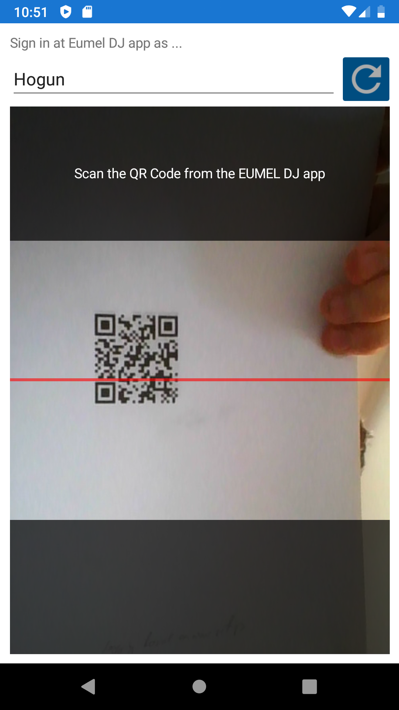
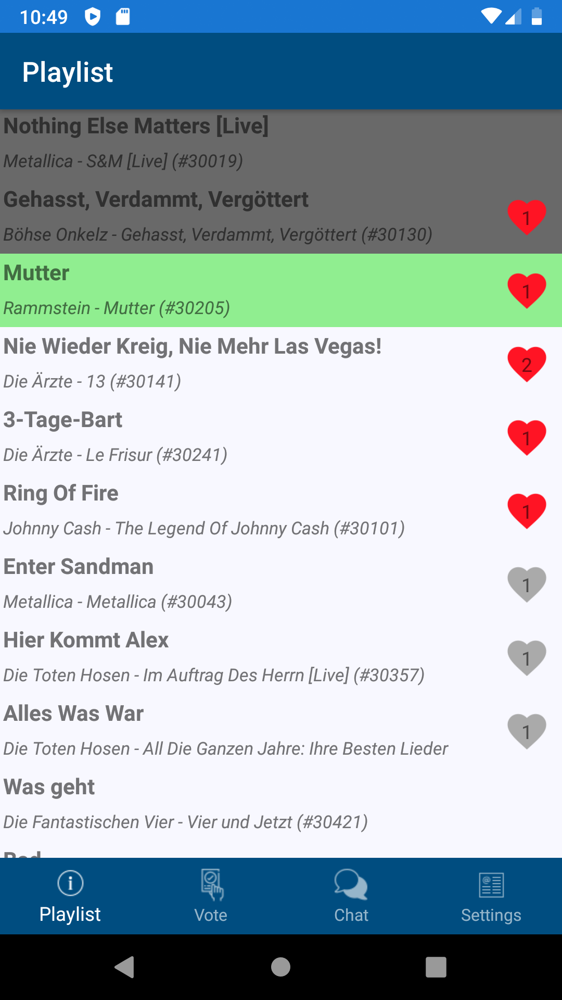
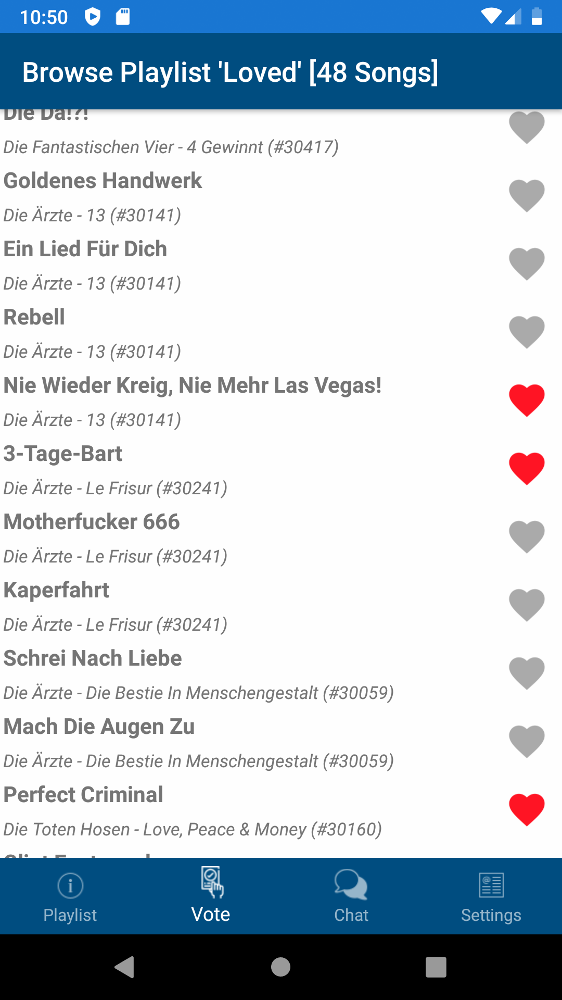
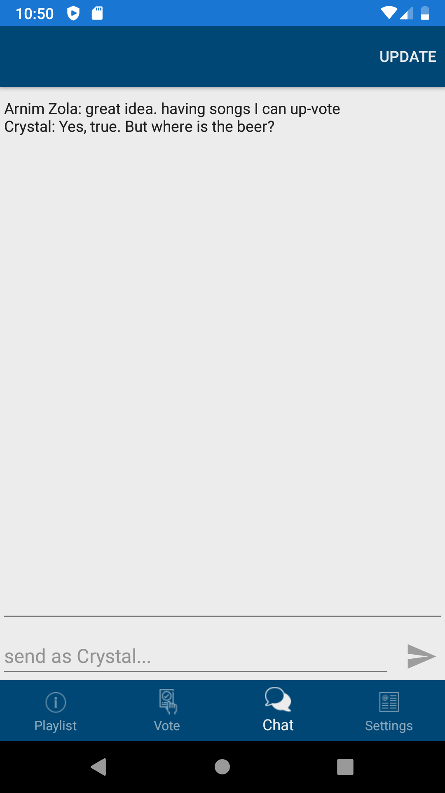

# EUMEL.Dj
A remote DJ application which plays songs on a party and guests can vote on songs to play.

## Mobile App

The mobile app uses a QR Code to connect to the application and get a token for communication. 

# Implementation Details

The implementation details can be found in a separate [https://marpit.marp.app/](marp)-based [marpme.md](presentation).

A [marpme.pdf](pdf document) is available but not always up to date.

